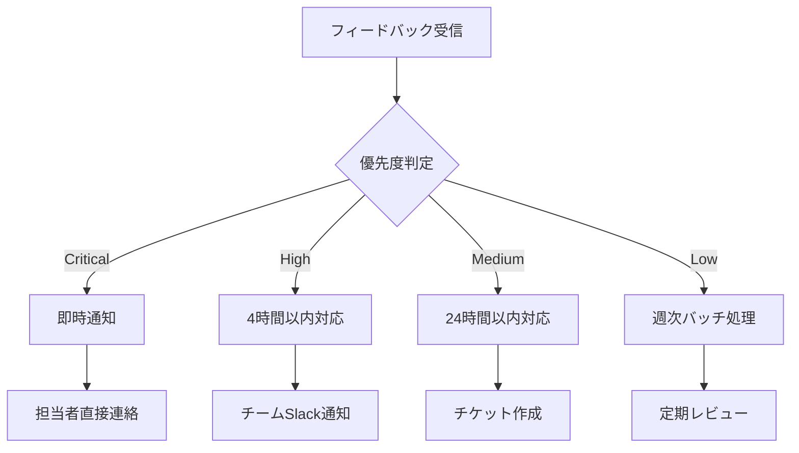

# AI-OS 顧客フィードバック管理ガイド
## 効果的なフィードバック収集と活用方法

**バージョン**: 1.0.0  
**最終更新日**: 2025年7月21日

---

## 📋 概要

AI-OSのフィードバック管理システムは、顧客の声を体系的に収集、分析、対応するための統合プラットフォームです。AIによる自動分類と感情分析により、重要なフィードバックを見逃さず、迅速な対応を可能にします。

### システムの特徴
- 🤖 **AI自動分析**: 感情分析、カテゴリー分類、優先度判定
- 📊 **統計ダッシュボード**: リアルタイムの傾向分析
- 🔄 **自動化ワークフロー**: ルールベースの自動振り分け
- 📧 **統合通知**: メール、Slack、アプリ内通知
- 🎯 **SLA管理**: 応答時間の追跡と改善

---

## 🔧 フィードバックタイプ

### 1. バグ報告（Bug Report）
**説明**: システムの不具合や期待と異なる動作  
**優先度**: 通常High以上  
**対応チーム**: 開発チーム  
**SLA**: 24時間以内に初回応答

### 2. 機能要望（Feature Request）
**説明**: 新機能や既存機能の改善提案  
**優先度**: Medium  
**対応チーム**: プロダクトチーム  
**SLA**: 48時間以内に初回応答

### 3. 改善提案（Improvement）
**説明**: UI/UXやワークフローの改善案  
**優先度**: Medium  
**対応チーム**: デザインチーム  
**SLA**: 72時間以内に初回応答

### 4. 苦情（Complaint）
**説明**: サービスや対応への不満  
**優先度**: High  
**対応チーム**: カスタマーサクセス  
**SLA**: 4時間以内に初回応答

### 5. 称賛（Praise）
**説明**: ポジティブなフィードバック  
**優先度**: Low  
**対応チーム**: 全チーム共有  
**SLA**: 1週間以内に返信

### 6. 質問（Question）
**説明**: 使い方や仕様に関する問い合わせ  
**優先度**: Medium  
**対応チーム**: サポートチーム  
**SLA**: 24時間以内に回答

---

## 📝 フィードバック送信方法

### 1. Web フォーム
```html
<!-- 埋め込み用フィードバックウィジェット -->
<script src="https://feedback.ai-os.com/widget.js"></script>
<div id="ai-os-feedback-widget" 
     data-api-key="YOUR_API_KEY"
     data-user-id="USER_ID"
     data-theme="light">
</div>
```

### 2. API経由
```javascript
// JavaScript SDK使用例
const feedback = await aiOS.feedback.create({
  type: 'feature_request',
  title: '給与明細のPDF一括ダウンロード機能',
  description: `
    複数月の給与明細を一括でダウンロードしたいです。
    現在は1ヶ月ずつしかダウンロードできないため、
    年末調整時などに不便を感じています。
  `,
  category: 'payroll',
  tags: ['pdf', 'bulk-download', 'payslip']
});

// ファイル添付付き
const formData = new FormData();
formData.append('type', 'bug_report');
formData.append('title', 'エラー画面のスクリーンショット');
formData.append('description', 'ログイン時にエラーが発生します');
formData.append('attachments', screenshotFile);

const response = await fetch('/api/v1/feedback', {
  method: 'POST',
  headers: {
    'Authorization': 'Bearer YOUR_API_KEY'
  },
  body: formData
});
```

### 3. アプリ内フィードバック
```typescript
// アプリ内フィードバックボタンの実装
import { FeedbackModal } from '@ai-os/feedback-ui';

function App() {
  const [showFeedback, setShowFeedback] = useState(false);

  return (
    <>
      <button onClick={() => setShowFeedback(true)}>
        フィードバックを送る
      </button>
      
      <FeedbackModal
        isOpen={showFeedback}
        onClose={() => setShowFeedback(false)}
        onSubmit={async (feedback) => {
          await submitFeedback(feedback);
          showToast('フィードバックを送信しました');
        }}
        prefilledData={{
          url: window.location.href,
          version: APP_VERSION
        }}
      />
    </>
  );
}
```

---

## 🤖 AI分析機能

### 感情分析（Sentiment Analysis）
フィードバックの感情を5段階で自動判定：

| レベル | 説明 | 例 |
|--------|------|-----|
| Very Positive | 非常に満足 | 「素晴らしい！完璧です！」 |
| Positive | 満足 | 「便利で助かっています」 |
| Neutral | 中立 | 「機能について質問があります」 |
| Negative | 不満 | 「使いにくいです」 |
| Very Negative | 非常に不満 | 「全く動作しません」 |

### 自動カテゴリー分類
```json
{
  "categories": {
    "ui": ["デザイン", "レイアウト", "ボタン", "画面"],
    "performance": ["遅い", "速度", "パフォーマンス", "読み込み"],
    "integration": ["API", "連携", "同期", "インポート"],
    "billing": ["請求", "料金", "支払い", "プラン"]
  }
}
```

### 優先度自動判定ロジック
```javascript
function determinePriority(feedback) {
  // エンタープライズ顧客
  if (feedback.customerPlan === 'enterprise') {
    return Priority.HIGH;
  }
  
  // バグ報告
  if (feedback.type === 'bug_report') {
    if (feedback.description.includes('データ損失') || 
        feedback.description.includes('ログインできない')) {
      return Priority.CRITICAL;
    }
    return Priority.HIGH;
  }
  
  // 感情分析結果
  if (feedback.sentiment === 'very_negative') {
    return Priority.HIGH;
  }
  
  return Priority.MEDIUM;
}
```

---

## 📊 管理者向け機能

### ダッシュボード
```
┌─────────────────────────────────────────────────────┐
│                フィードバックダッシュボード              │
├─────────────────────────────────────────────────────┤
│  今月の統計                                          │
│  ├─ 総数: 234件 (+12% 前月比)                       │
│  ├─ 平均応答時間: 2.3時間                           │
│  ├─ 解決率: 87%                                    │
│  └─ 満足度: 4.2/5.0                               │
│                                                     │
│  タイプ別内訳         優先度別                       │
│  ├─ バグ報告: 45%    ├─ Critical: 5%              │
│  ├─ 機能要望: 30%    ├─ High: 25%                 │
│  ├─ 改善提案: 15%    ├─ Medium: 50%               │
│  └─ その他: 10%      └─ Low: 20%                  │
└─────────────────────────────────────────────────────┘
```

### 自動化ルール設定
```yaml
# feedback-automation-rules.yaml
rules:
  - name: "エンタープライズ顧客の自動エスカレーション"
    condition:
      customerPlan: "enterprise"
      priority: ["high", "critical"]
    actions:
      - assignTo: "senior-support-team"
      - notifySlack: "#enterprise-alerts"
      - setSLA: "2hours"

  - name: "重大バグの開発チーム通知"
    condition:
      type: "bug_report"
      keywords: ["データ損失", "システムダウン", "ログイン不可"]
    actions:
      - assignTo: "dev-oncall"
      - priority: "critical"
      - createJiraTicket: true

  - name: "ポジティブフィードバックの共有"
    condition:
      sentiment: ["positive", "very_positive"]
    actions:
      - shareToSlack: "#team-wins"
      - addTag: "testimonial"
```

### レポート生成
```javascript
// 月次レポートの生成
const report = await feedbackSystem.generateReport({
  period: 'month',
  metrics: [
    'totalCount',
    'typeDistribution',
    'averageResolutionTime',
    'satisfactionScore',
    'topTags',
    'trendAnalysis'
  ],
  format: 'pdf'
});

// カスタムレポート
const customReport = await feedbackSystem.query({
  filters: {
    type: 'feature_request',
    status: 'resolved',
    dateRange: { start: '2025-01-01', end: '2025-06-30' }
  },
  groupBy: 'category',
  metrics: ['count', 'averageResolutionTime'],
  export: 'excel'
});
```

---

## 🔄 フィードバックライフサイクル

### 1. 受付（New）
- フィードバック受信
- AI自動分析
- 初期分類・タグ付け
- 自動応答メール送信

### 2. トリアージ（Triaged）
- 担当チーム割り当て
- 優先度確定
- SLA設定
- 関連チケット紐付け

### 3. 対応中（In Progress）
- 調査・分析
- 解決策の検討
- 顧客とのコミュニケーション
- 進捗更新

### 4. 解決（Resolved）
- 解決策の実装/回答
- 顧客への通知
- 満足度調査送信
- ナレッジベース更新

### 5. クローズ（Closed）
- 最終確認
- 統計への反映
- 学習データとして保存
- 関連ドキュメント更新

---

## 💡 ベストプラクティス

### 効果的なフィードバック収集

#### 1. プロアクティブな収集
```javascript
// 特定のアクション後にフィードバックを求める
function onFeatureUsed(feature) {
  if (shouldAskFeedback(feature)) {
    setTimeout(() => {
      showFeedbackPrompt({
        title: `${feature}機能はいかがでしたか？`,
        type: 'rating',
        followUp: true
      });
    }, 5000);
  }
}
```

#### 2. コンテキスト情報の自動収集
```javascript
// フィードバック送信時の環境情報
const context = {
  url: window.location.href,
  userAgent: navigator.userAgent,
  screenSize: `${screen.width}x${screen.height}`,
  timestamp: new Date().toISOString(),
  sessionDuration: getSessionDuration(),
  lastActions: getLastActions(10),
  errorLogs: getRecentErrors()
};
```

#### 3. インセンティブ設計
- 初回フィードバック送信でバッジ付与
- 月間アクティブフィードバッカー表彰
- 採用された機能要望の実装通知

### 迅速な対応

#### 1. 自動返信テンプレート
```javascript
const autoResponses = {
  bug_report: `
    バグ報告をいただきありがとうございます。
    
    開発チームが調査を開始しました。
    24時間以内に詳細な回答をお送りします。
    
    チケット番号: {{ticketId}}
    優先度: {{priority}}
  `,
  
  feature_request: `
    機能のご提案ありがとうございます。
    
    プロダクトチームがレビューを行い、
    実装可能性を検討いたします。
    
    類似の要望: {{similarCount}}件
    想定検討期間: 2週間
  `
};
```

#### 2. エスカレーションフロー


---

## 📈 分析と改善

### KPIモニタリング

| 指標 | 目標値 | 計算方法 |
|------|--------|----------|
| 初回応答時間 | < 4時間 | 受信〜初回返信の平均時間 |
| 解決時間 | < 48時間 | 受信〜解決の平均時間 |
| 満足度スコア | > 4.0/5.0 | 解決後アンケートの平均 |
| 解決率 | > 90% | 解決数/総数 |
| 再オープン率 | < 5% | 再オープン数/解決数 |

### トレンド分析
```sql
-- 週次トレンド分析クエリ
SELECT 
  DATE_TRUNC('week', created_at) as week,
  type,
  COUNT(*) as count,
  AVG(EXTRACT(epoch FROM (resolved_at - created_at))/3600) as avg_resolution_hours,
  AVG(satisfaction_score) as avg_satisfaction
FROM feedbacks
WHERE created_at >= CURRENT_DATE - INTERVAL '3 months'
GROUP BY week, type
ORDER BY week DESC;
```

### 改善アクション
1. **頻出問題の特定**: 同じ問題の繰り返しを検出
2. **ドキュメント改善**: よくある質問の文書化
3. **機能改善**: フィードバックに基づく優先順位付け
4. **プロセス最適化**: ボトルネックの特定と解消

---

## 🔗 統合とAPI

### Webhook設定
```javascript
// フィードバックイベントのWebhook
POST https://your-app.com/webhooks/feedback
{
  "event": "feedback.created",
  "data": {
    "id": "fb123",
    "type": "bug_report",
    "priority": "high",
    "customer": { ... },
    "content": { ... }
  },
  "timestamp": "2025-07-21T10:30:00Z"
}
```

### 外部ツール連携
- **Jira**: バグ報告の自動チケット作成
- **Slack**: リアルタイム通知
- **Zendesk**: サポートチケット連携
- **Salesforce**: 顧客情報同期

---

## 🎯 成功事例

### Case 1: レスポンスタイム50%削減
**課題**: 平均応答時間が8時間  
**施策**: AI自動分類と自動振り分け導入  
**結果**: 平均4時間に短縮、満足度15%向上

### Case 2: 機能要望の製品化率向上
**課題**: 要望の優先順位付けが困難  
**施策**: 投票システムと影響度分析導入  
**結果**: 採用率が20%から35%に向上

### Case 3: サポートコスト削減
**課題**: 同じ質問の繰り返し対応  
**施策**: FAQ自動提案とセルフサービス強化  
**結果**: サポート工数30%削減

---

## 📞 サポート

フィードバックシステムに関するお問い合わせ：
- **ドキュメント**: https://docs.ai-os.com/feedback
- **API仕様**: https://api.ai-os.com/docs/feedback
- **サポート**: feedback-support@ai-os.com

---

**継続的改善**: フィードバックは製品改善の原動力です。すべての声を大切にし、より良いサービスの提供を目指しましょう。