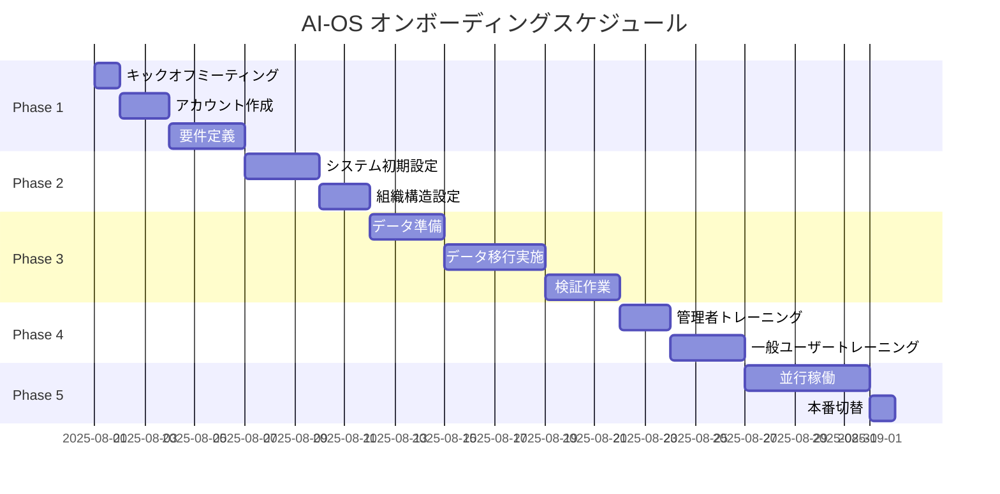

# AI-OS 顧客オンボーディングガイド
## お客様の成功への完全ガイド

**バージョン**: 1.0.0  
**最終更新日**: 2025年7月21日

---

## 📋 目次

1. [はじめに](#はじめに)
2. [オンボーディングプロセス概要](#オンボーディングプロセス概要)
3. [Phase 1: 準備フェーズ（契約〜1週目）](#phase-1-準備フェーズ)
4. [Phase 2: 基本設定フェーズ（2週目）](#phase-2-基本設定フェーズ)
5. [Phase 3: データ移行フェーズ（3-4週目）](#phase-3-データ移行フェーズ)
6. [Phase 4: トレーニングフェーズ（5週目）](#phase-4-トレーニングフェーズ)
7. [Phase 5: 本番稼働フェーズ（6週目〜）](#phase-5-本番稼働フェーズ)
8. [サポート体制](#サポート体制)
9. [よくある質問](#よくある質問)

---

## 🎯 はじめに

AI-OSをご導入いただき、誠にありがとうございます。本ガイドは、お客様がAI-OSをスムーズに導入し、最大限の価値を得られるよう設計されています。

### オンボーディングの目標
- ✅ 6週間以内に本番稼働開始
- ✅ 全従業員がシステムを使いこなせる状態
- ✅ 既存業務の完全移行
- ✅ AIエージェントの最適化完了

---

## 🗓️ オンボーディングプロセス概要



---

## 📝 Phase 1: 準備フェーズ（契約〜1週目）

### 1.1 キックオフミーティング

**実施内容**:
- プロジェクトメンバー紹介
- スケジュール確認
- 成功基準の定義
- コミュニケーション方法の確立

**お客様にご準備いただくもの**:
- [ ] プロジェクト責任者の任命
- [ ] IT担当者の任命
- [ ] 各部門の代表者選定

### 1.2 アカウント作成と環境準備

**当社が実施**:
```bash
# お客様専用環境の構築
./scripts/setup-customer-env.sh "お客様名" "customer-id"
```

**お客様にお渡しするもの**:
- 管理者アカウント情報
- アクセスURL
- 初期設定ガイド

### 1.3 要件定義セッション

**ヒアリング項目**:
1. **組織情報**
   - 会社概要、業種、規模
   - 組織構造（部門、チーム）
   - 従業員数、雇用形態

2. **現状の業務フロー**
   - 勤怠管理方法
   - 給与計算プロセス
   - 経費精算フロー

3. **システム連携要件**
   - 既存システム（会計、ERP等）
   - 必要な連携機能
   - データフォーマット

---

## ⚙️ Phase 2: 基本設定フェーズ（2週目）

### 2.1 システム初期設定

#### 会社基本情報設定
```
設定 > 会社情報
- 会社名、所在地
- 事業年度設定
- 就業規則アップロード
```

#### 勤怠設定
```
設定 > 勤怠管理
- 所定労働時間
- 休憩時間ルール
- 残業計算ルール
- 36協定内容
```

#### 給与設定
```
設定 > 給与管理
- 給与体系（月給制/時給制）
- 各種手当設定
- 控除項目設定
- 締め日・支払日
```

### 2.2 組織構造設定

#### 部門・チーム登録
1. **部門マスタ作成**
   ```
   マスタ管理 > 部門管理
   - 部門コード
   - 部門名
   - 上位部門
   - 責任者設定
   ```

2. **権限設定**
   ```
   設定 > 権限管理
   - 役職別権限
   - 承認ルート
   - データアクセス範囲
   ```

### 2.3 AIエージェント初期設定

```
AI管理 > エージェント設定
- 給与計算エージェント: 計算ルール学習
- コンプライアンスエージェント: 監視項目設定
- 経費処理エージェント: 承認ルール設定
```

---

## 📊 Phase 3: データ移行フェーズ（3-4週目）

### 3.1 データ準備

#### 必要データ一覧

| データ種別 | 形式 | 必須/任意 | テンプレート |
|-----------|------|----------|-------------|
| 従業員マスタ | CSV/Excel | 必須 | [ダウンロード](templates/employee_master.xlsx) |
| 部門マスタ | CSV/Excel | 必須 | [ダウンロード](templates/department_master.xlsx) |
| 勤怠履歴 | CSV/Excel | 任意 | [ダウンロード](templates/time_records.xlsx) |
| 給与履歴 | CSV/Excel | 任意 | [ダウンロード](templates/payroll_history.xlsx) |

#### データクレンジング

**チェックポイント**:
- [ ] 文字コード: UTF-8
- [ ] 日付形式: YYYY-MM-DD
- [ ] 必須項目の入力漏れ
- [ ] 重複データの削除

### 3.2 データ移行実施

#### 移行手順

1. **テスト環境での検証**
   ```
   データインポート > テスト実行
   - エラーチェック
   - データ整合性確認
   - 計算結果検証
   ```

2. **本番環境への移行**
   ```
   データインポート > 本番実行
   - バックアップ取得
   - インポート実行
   - 移行結果確認
   ```

### 3.3 移行後検証

**検証項目チェックリスト**:
- [ ] 従業員数の一致
- [ ] 部門構造の正確性
- [ ] 過去データの表示確認
- [ ] 計算結果の妥当性
- [ ] レポート出力確認

---

## 🎓 Phase 4: トレーニングフェーズ（5週目）

### 4.1 管理者向けトレーニング

#### Day 1: システム管理基礎
- システム概要とアーキテクチャ
- 管理画面の使い方
- ユーザー管理
- 権限設定
- **実習**: 新規ユーザー登録

#### Day 2: 高度な機能
- AIエージェント管理
- カスタムレポート作成
- システム連携設定
- トラブルシューティング
- **実習**: レポート作成

### 4.2 一般ユーザー向けトレーニング

#### Day 1: 基本操作
- ログイン方法
- ダッシュボードの見方
- 勤怠打刻
- 申請・承認
- **実習**: 1日の業務フロー

#### Day 2: 日常業務
- 勤怠修正
- 休暇申請
- 経費精算
- 給与明細確認
- **実習**: 月次処理

#### Day 3: 応用機能
- レポート参照
- データエクスポート
- モバイルアプリ使用
- よくあるQ&A
- **実習**: 総合演習

### 4.3 トレーニング教材

**提供資料**:
- 📚 操作マニュアル（PDF）
- 🎥 操作動画（各機能5-10分）
- 💡 クイックリファレンス
- ❓ FAQ集

---

## 🚀 Phase 5: 本番稼働フェーズ（6週目〜）

### 5.1 並行稼働期間

**1週間の並行稼働**:
- 既存システムとAI-OSを並行運用
- データの二重入力
- 結果の照合
- 問題点の洗い出し

### 5.2 本番切替

#### 切替前チェックリスト
- [ ] 全ユーザーのトレーニング完了
- [ ] 初月の給与計算テスト成功
- [ ] バックアップ体制確立
- [ ] 緊急連絡体制確立

#### 切替作業
```
1. 既存システムのデータ最終同期
2. AI-OS を本番モードに切替
3. 全ユーザーへの通知
4. 初日サポート体制
```

### 5.3 定着化支援（1-3ヶ月）

**週次フォローアップ**:
- 利用状況レビュー
- 問題点の解決
- 追加トレーニング
- 機能最適化提案

---

## 💬 サポート体制

### 通常サポート

| チャネル | 対応時間 | 用途 |
|---------|---------|------|
| メール | 24時間受付 | 一般的な質問 |
| 電話 | 平日 9:00-18:00 | 緊急の問題 |
| チャット | 平日 9:00-20:00 | 操作方法の質問 |
| ポータル | 24時間 | ドキュメント参照 |

### オンボーディング期間中の特別サポート

- **専任カスタマーサクセスマネージャー**
  - 週次定例ミーティング
  - 進捗管理
  - エスカレーション対応

- **優先サポート**
  - 応答時間: 30分以内
  - 専用Slackチャンネル
  - オンサイトサポート（必要時）

---

## ❓ よくある質問

### Q1: データ移行に失敗した場合は？
**A**: すべての移行作業前にバックアップを取得しているため、いつでも再実行可能です。エラーログを基に原因を特定し、修正後に再度実行します。

### Q2: トレーニングに参加できなかった従業員への対応は？
**A**: 録画されたトレーニング動画と自習用教材を提供します。また、追加のオンライントレーニングセッションも実施可能です。

### Q3: カスタマイズは可能ですか？
**A**: エンタープライズプランでは、お客様固有の要件に応じたカスタマイズが可能です。要件定義時にご相談ください。

### Q4: 既存システムとの連携で問題が発生したら？
**A**: 技術サポートチームが対応します。必要に応じて、連携先システムのベンダーとも協力して解決にあたります。

### Q5: AIエージェントの精度が低い場合は？
**A**: 初期は学習期間が必要です。1-2ヶ月の運用データが蓄積されると精度が向上します。必要に応じてチューニングも実施します。

---

## 📅 オンボーディング完了基準

### ✅ 完了チェックリスト

- [ ] 全従業員のアカウント作成完了
- [ ] 初回給与計算の成功
- [ ] 月次締め処理の完了
- [ ] 管理者による承認フロー確立
- [ ] AIエージェントの稼働確認
- [ ] バックアップ・リカバリテスト成功
- [ ] ユーザー満足度調査実施（目標: 4.0/5.0以上）

### 🎉 Go-Liveセレモニー

オンボーディング完了時には、以下を実施：
- プロジェクト振り返り会
- 改善提案の共有
- 今後のロードマップ説明
- 成功事例として社内共有（ご了承いただいた場合）

---

## 📞 お問い合わせ

**カスタマーサクセスチーム**
- 📧 onboarding@ai-os.com
- 📱 03-XXXX-XXXX
- 💬 Slack: #ai-os-onboarding

**緊急時連絡先**
- 📱 080-XXXX-XXXX（24時間対応）

---

**私たちは、お客様の成功が私たちの成功だと考えています。**  
**AI-OSで、共に未来の働き方を創造しましょう。**

© 2025 AI-OS Corporation. All rights reserved.