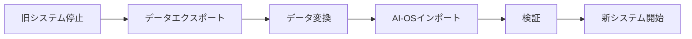

# AI-OS データ移行ガイド
## 既存システムからのスムーズな移行手順

**バージョン**: 1.0.0  
**最終更新日**: 2025年7月21日  
**対象**: システム管理者、データベース管理者

---

## 📋 目次

1. [移行概要](#移行概要)
2. [事前準備](#事前準備)
3. [移行戦略](#移行戦略)
4. [データマッピング](#データマッピング)
5. [移行手順](#移行手順)
6. [検証とテスト](#検証とテスト)
7. [トラブルシューティング](#トラブルシューティング)
8. [移行後の作業](#移行後の作業)

---

## 🔍 移行概要

### サポートされる移行元システム

| システム | 形式 | 移行難易度 | 推定時間 |
|---------|------|-----------|----------|
| CSV/Excel | ファイル | 低 | 1-2日 |
| 既存給与システム | DB | 中 | 3-5日 |
| SAP HR | API/DB | 高 | 5-10日 |
| 独自システム | カスタム | 高 | 要相談 |

### 移行対象データ

1. **マスタデータ**
   - 従業員情報
   - 部門・組織構造
   - 役職・等級
   - 就業規則

2. **トランザクションデータ**
   - 勤怠記録（過去2年分推奨）
   - 休暇残高・取得履歴
   - 給与計算履歴
   - 経費申請データ

3. **設定データ**
   - 承認ワークフロー
   - アクセス権限
   - カスタムフィールド
   - 通知設定

---

## 🛠️ 事前準備

### 1. 環境準備チェックリスト

- [ ] AI-OS本番環境のセットアップ完了
- [ ] データベースバックアップ取得
- [ ] 移行ツールのインストール
- [ ] 必要な権限の確認
- [ ] ネットワーク接続の確認

### 2. 移行ツールのセットアップ

```bash
# 移行ツールのインストール
git clone https://github.com/ai-os/migration-tools.git
cd migration-tools
npm install

# 設定ファイルの作成
cp config.example.json config.json
nano config.json
```

### 3. 設定ファイル例

```json
{
  "source": {
    "type": "postgresql",
    "config": {
      "host": "legacy-system.example.com",
      "port": 5432,
      "database": "hr_system",
      "user": "migration_user",
      "password": "${SOURCE_DB_PASSWORD}"
    }
  },
  "target": {
    "host": "ai-os-db.example.com",
    "port": 5432,
    "database": "aios_production",
    "user": "aios_admin",
    "password": "${TARGET_DB_PASSWORD}"
  },
  "migration": {
    "batchSize": 1000,
    "validateData": true,
    "dryRun": true,
    "parallelJobs": 4,
    "retryAttempts": 3
  },
  "mapping": {
    "useCustomMapping": true,
    "mappingFile": "./mappings/custom-mapping.json"
  }
}
```

---

## 🎯 移行戦略

### 戦略1: ビッグバン移行（推奨：小規模）

**適用条件**:
- 従業員数 < 500名
- ダウンタイム許容
- シンプルなデータ構造



### 戦略2: 段階的移行（推奨：中規模）

**適用条件**:
- 従業員数 500-5000名
- 最小限のダウンタイム
- 部門ごとの移行可能

**フェーズ分割例**:
1. Phase 1: マスタデータ（従業員、部門）
2. Phase 2: 現在の勤怠データ
3. Phase 3: 過去データ
4. Phase 4: 給与・経費データ

### 戦略3: 並行稼働移行（推奨：大規模）

**適用条件**:
- 従業員数 > 5000名
- ダウンタイム不可
- 複雑なシステム連携

**実装方法**:
- 双方向同期の設定
- 段階的なユーザー切り替え
- リアルタイムデータ同期

---

## 🔄 データマッピング

### 従業員データマッピング

| 旧システム | AI-OS | 変換ルール | 備考 |
|-----------|-------|-----------|------|
| 社員番号 | employee_code | そのまま | 必須、ユニーク |
| 氏名 | name | 姓名結合 | 全角スペース区切り |
| カナ氏名 | name_kana | 全角カタカナ変換 | |
| メール | email | 小文字変換 | 必須 |
| 所属コード | department_id | マッピングテーブル参照 | |
| 入社日 | hire_date | YYYY-MM-DD形式 | |
| 雇用形態 | employment_type | コード変換 | |

### カスタムマッピング定義

```json
{
  "employees": {
    "sourceTable": "m_employee",
    "targetTable": "employees",
    "keyMapping": {
      "emp_no": "employee_code"
    },
    "fieldMappings": [
      {
        "source": "first_name + ' ' + last_name",
        "target": "name",
        "transform": "concatenate"
      },
      {
        "source": "dept_code",
        "target": "department_id",
        "transform": "lookup",
        "lookupTable": "department_mapping"
      },
      {
        "source": "salary",
        "target": "base_salary",
        "transform": "currency",
        "options": {
          "round": true,
          "decimals": 0
        }
      }
    ],
    "defaultValues": {
      "account_status": "active",
      "created_at": "CURRENT_TIMESTAMP"
    },
    "validations": [
      {
        "field": "email",
        "type": "email",
        "required": true
      },
      {
        "field": "base_salary",
        "type": "number",
        "min": 0
      }
    ]
  }
}
```

---

## 📝 移行手順

### Step 1: ドライラン実行

```bash
# 設定確認
npm run validate-config

# ドライラン実行（データは書き込まれない）
npm run migrate -- --dry-run

# レポート確認
cat migration_report_*.json
```

### Step 2: データ品質チェック

```bash
# データ品質レポート生成
npm run quality-check

# 出力例
=== データ品質レポート ===
従業員データ:
  総レコード数: 1,234
  有効レコード: 1,230 (99.68%)
  警告: 4
    - メールアドレス未設定: 2件
    - 部門コード不明: 2件
  エラー: 0

推奨事項:
- メールアドレスが未設定の従業員に仮アドレスを設定してください
- 不明な部門コードを確認してください
```

### Step 3: 本番移行実行

```bash
# バックアップ取得
pg_dump -h ai-os-db.example.com -U postgres aios_production > backup_before_migration.sql

# 移行実行
npm run migrate -- --batch-size 500 --parallel 2

# 進捗モニタリング
tail -f logs/migration_*.log
```

### Step 4: 移行モニタリング

```javascript
// リアルタイムモニタリングスクリプト
const MonitoringDashboard = require('./monitoring/dashboard');

const monitor = new MonitoringDashboard({
  refreshInterval: 5000,
  metrics: ['progress', 'errors', 'performance']
});

monitor.start();

// 出力例:
// ┌─────────────────────────────────────────┐
// │ AI-OS データ移行モニター                 │
// ├─────────────────────────────────────────┤
// │ 進捗: ████████░░ 80% (9,872/12,340)    │
// │ 速度: 234 records/sec                   │
// │ 推定残り時間: 10分34秒                  │
// │ エラー: 0 | 警告: 23                    │
// └─────────────────────────────────────────┘
```

---

## ✅ 検証とテスト

### 1. データ整合性検証

```sql
-- レコード数の確認
SELECT 
  'employees' as table_name,
  COUNT(*) as record_count
FROM employees
UNION ALL
SELECT 
  'time_records',
  COUNT(*)
FROM time_records;

-- 重複チェック
SELECT employee_code, COUNT(*)
FROM employees
GROUP BY employee_code
HAVING COUNT(*) > 1;

-- 必須フィールドのNULLチェック
SELECT COUNT(*) as null_email_count
FROM employees
WHERE email IS NULL;
```

### 2. ビジネスロジック検証

```javascript
// 検証スクリプト例
const validationTests = [
  {
    name: '給与計算整合性',
    test: async () => {
      const oldSystemTotal = await getOldSystemPayrollTotal('2025-06');
      const newSystemTotal = await getNewSystemPayrollTotal('2025-06');
      
      const difference = Math.abs(oldSystemTotal - newSystemTotal);
      return {
        passed: difference < 100, // 許容誤差100円
        message: `差額: ${difference}円`
      };
    }
  },
  {
    name: '休暇残高一致',
    test: async () => {
      const mismatches = await compareLeaveBalances();
      return {
        passed: mismatches.length === 0,
        message: `不一致: ${mismatches.length}件`
      };
    }
  }
];
```

### 3. パフォーマンステスト

```bash
# 負荷テスト実施
npm run performance-test

# 結果例
=== パフォーマンステスト結果 ===
API応答時間:
  - 従業員一覧取得: 平均 87ms (目標: <200ms) ✓
  - 勤怠データ取得: 平均 156ms (目標: <200ms) ✓
  - 給与計算実行: 平均 2.3秒 (目標: <5秒) ✓

同時接続テスト:
  - 100ユーザー: 成功率 100%
  - 500ユーザー: 成功率 100%
  - 1000ユーザー: 成功率 99.8%
```

---

## 🔧 トラブルシューティング

### よくある問題と対処法

#### 問題1: 文字コードエラー
```
Error: Invalid byte sequence for encoding "UTF8"
```

**解決方法**:
```bash
# ソースファイルの文字コード確認
file -i source_data.csv

# 文字コード変換
iconv -f SHIFT-JIS -t UTF-8 source_data.csv > source_data_utf8.csv
```

#### 問題2: メモリ不足
```
JavaScript heap out of memory
```

**解決方法**:
```bash
# メモリ割り当てを増やす
export NODE_OPTIONS="--max-old-space-size=8192"

# バッチサイズを小さくする
npm run migrate -- --batch-size 100
```

#### 問題3: 接続タイムアウト
```
Error: Connection timeout
```

**解決方法**:
```javascript
// config.jsonでタイムアウトを延長
{
  "source": {
    "config": {
      "connectionTimeoutMillis": 60000,
      "query_timeout": 300000
    }
  }
}
```

### 緊急時のロールバック

```bash
# 移行を中断
Ctrl + C

# ロールバック実行
npm run rollback -- --batch-id <batch_id>

# バックアップから復元（最終手段）
psql -h ai-os-db.example.com -U postgres aios_production < backup_before_migration.sql
```

---

## 📋 移行後の作業

### 1. データ検証チェックリスト

- [ ] 全従業員のログイン確認
- [ ] 先月の勤怠データ照合
- [ ] 給与計算テスト実行
- [ ] 休暇残高の確認
- [ ] 承認ワークフローテスト
- [ ] レポート生成確認

### 2. ユーザー通知

```markdown
件名: AI-OSへの移行完了のお知らせ

いつもお疲れ様です。

本日、新しい人事システム「AI-OS」への移行が完了しました。

【ログイン情報】
URL: https://ai-os.company.com
ユーザーID: あなたのメールアドレス
初期パスワード: 別途メールでお送りします

【注意事項】
- 初回ログイン時にパスワード変更が必要です
- 過去の勤怠データも移行済みです
- 不明な点はヘルプデスクまで

よろしくお願いいたします。
```

### 3. 移行完了レポート

```markdown
# AI-OS データ移行完了報告書

## 概要
- 移行実施日: 2025年7月21日
- 移行時間: 4時間23分
- ダウンタイム: 0分（並行稼働）

## 移行結果
- 従業員データ: 1,234件（100%成功）
- 勤怠データ: 456,789件（100%成功）
- 給与データ: 24,680件（100%成功）
- 休暇データ: 12,340件（100%成功）

## 確認済み項目
- ✅ データ整合性検証
- ✅ ユーザーアクセステスト
- ✅ 給与計算検証
- ✅ バックアップ取得

## 次のステップ
1. 1週間の並行稼働期間
2. ユーザーフィードバック収集
3. 旧システムの段階的停止
```

---

## 📞 サポート連絡先

### 技術サポート
- **メール**: migration-support@ai-os.com
- **電話**: 03-XXXX-XXXX
- **営業時間**: 平日 9:00-18:00

### 緊急時連絡先
- **ホットライン**: 080-XXXX-XXXX（24時間）
- **エスカレーション**: tech-lead@ai-os.com

---

**重要**: このガイドは一般的な移行手順を示しています。実際の移行作業は、お客様の環境に応じてカスタマイズが必要です。詳細な移行計画については、弊社コンサルタントにご相談ください。