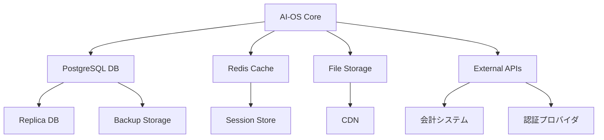

# AI-OS ディザスタリカバリ計画書
## 災害復旧とビジネス継続性確保のための包括的計画

**バージョン**: 1.0.0  
**最終更新日**: 2025年7月21日  
**機密レベル**: 🔴 社外秘  
**次回レビュー**: 2025年10月21日

---

## 📊 エグゼクティブサマリー

本計画書は、AI-OSプラットフォームにおける災害や重大インシデント発生時の事業継続性を確保するための包括的な対応計画です。自然災害、サイバー攻撃、システム障害などあらゆる脅威に対する迅速な復旧手順を定義し、顧客への影響を最小限に抑えます。

### 主要目標
- **RTO（目標復旧時間）**: 4時間以内
- **RPO（目標復旧時点）**: 1時間以内
- **サービス可用性**: 99.9%維持
- **データ損失**: ゼロ

---

## 🎯 計画の範囲と目的

### 対象システム
- AI-OSプロダクション環境
- データベースクラスター
- ファイルストレージ
- バックアップシステム
- ネットワークインフラ

### 対象となる災害シナリオ
1. **自然災害**: 地震、火災、洪水、台風
2. **技術的障害**: ハードウェア故障、ソフトウェアバグ、データ破損
3. **サイバー脅威**: ランサムウェア、DDoS攻撃、データ漏洩
4. **人的要因**: オペレーションミス、内部脅威
5. **外部要因**: 電力供給停止、ネットワーク障害

---

## 🏢 組織体制

### 災害対策本部（DCT: Disaster Control Team）

```
┌─────────────────────────┐
│    災害対策本部長        │
│      （CEO/CTO）        │
└───────────┬─────────────┘
            │
    ┌───────┴───────┬───────────┬───────────┐
    │               │           │           │
┌───▼───┐     ┌───▼───┐   ┌───▼───┐   ┌───▼───┐
│技術対応│     │事業継続│   │広報対応│   │顧客対応│
│ チーム │     │ チーム │   │ チーム │   │ チーム │
└─────────┘     └─────────┘   └─────────┘   └─────────┘
```

### 役割と責任

| 役職 | 担当者 | 責任範囲 | 連絡先 |
|------|--------|----------|---------|
| 災害対策本部長 | CTO | 全体統括、最終判断 | xxx-xxxx-xxxx |
| 技術対応リーダー | インフラ部長 | システム復旧 | xxx-xxxx-xxxx |
| 事業継続リーダー | COO | 業務継続性確保 | xxx-xxxx-xxxx |
| 広報対応リーダー | 広報部長 | 対外コミュニケーション | xxx-xxxx-xxxx |
| 顧客対応リーダー | CS部長 | 顧客サポート | xxx-xxxx-xxxx |

### エスカレーションマトリクス

| レベル | 影響度 | 初動対応 | エスカレーション先 | 対応時間 |
|--------|--------|----------|-------------------|----------|
| L1 | 限定的 | オンコールエンジニア | チームリーダー | 30分 |
| L2 | 中程度 | チームリーダー | 部門長 | 1時間 |
| L3 | 重大 | 部門長 | 災害対策本部 | 15分 |
| L4 | 危機的 | 災害対策本部 | 経営会議 | 即時 |

---

## 🔍 ビジネスインパクト分析（BIA）

### クリティカルシステムの優先順位

| システム/機能 | 優先度 | 最大許容停止時間 | 影響 | 代替手段 |
|--------------|--------|----------------|------|----------|
| 認証システム | Critical | 1時間 | 全ユーザーログイン不可 | 緊急アクセストークン |
| 給与計算エンジン | Critical | 4時間 | 給与支払い遅延 | 手動計算プロセス |
| 勤怠記録API | High | 2時間 | 打刻不可 | モバイルアプリキャッシュ |
| レポート生成 | Medium | 8時間 | 分析機能停止 | 事前生成レポート |
| 通知システム | Low | 24時間 | 通知遅延 | メール直接送信 |

### 依存関係マップ



---

## 🛡️ 予防的対策

### 1. インフラストラクチャの冗長性

#### マルチリージョン構成
```
東京リージョン（Primary）          大阪リージョン（Secondary）
┌─────────────────┐              ┌─────────────────┐
│  Load Balancer  │              │  Load Balancer  │
├─────────────────┤              ├─────────────────┤
│   App Servers   │◄────Sync────►│   App Servers   │
│   (3 nodes)     │              │   (3 nodes)     │
├─────────────────┤              ├─────────────────┤
│   PostgreSQL    │◄─Streaming──►│   PostgreSQL    │
│   (Primary)     │  Replication │   (Standby)     │
├─────────────────┤              ├─────────────────┤
│   Redis Cluster │◄────Sync────►│   Redis Cluster │
└─────────────────┘              └─────────────────┘
```

#### データセンター仕様
- **Tier**: Tier III以上
- **電源**: N+1冗長性、UPS、自家発電
- **ネットワーク**: 複数ISP、BGPによる自動フェイルオーバー
- **冷却**: N+1冗長性
- **物理セキュリティ**: 24/7監視、生体認証

### 2. データ保護戦略

#### バックアップポリシー（3-2-1ルール）
- **3**: データのコピーを3つ保持
- **2**: 2つの異なるメディアタイプ
- **1**: 1つはオフサイト保管

```bash
# バックアップスケジュール
0 */1 * * * /opt/ai-os/scripts/backup-incremental.sh  # 毎時（増分）
0 2 * * *   /opt/ai-os/scripts/backup-daily.sh       # 毎日2時（完全）
0 3 * * 0   /opt/ai-os/scripts/backup-weekly.sh      # 毎週日曜3時
0 4 1 * *   /opt/ai-os/scripts/backup-monthly.sh     # 毎月1日4時
```

#### スナップショット戦略
```yaml
# AWS EBSスナップショット設定
SnapshotPolicy:
  Frequency: Hourly
  RetentionDays: 7
  CrossRegionCopy:
    - Region: ap-northeast-3  # 大阪
      RetentionDays: 30
  Encryption: true
  Tags:
    - Key: Purpose
      Value: DisasterRecovery
```

### 3. セキュリティ対策

#### DDoS防御
```nginx
# Nginx設定
limit_req_zone $binary_remote_addr zone=api:10m rate=10r/s;
limit_req_zone $binary_remote_addr zone=login:10m rate=5r/m;
limit_conn_zone $binary_remote_addr zone=addr:10m;

server {
    location /api {
        limit_req zone=api burst=20 nodelay;
        limit_conn addr 10;
    }
    
    location /login {
        limit_req zone=login burst=5 nodelay;
    }
}
```

#### 侵入検知システム（IDS）
```yaml
# Falco設定
- rule: Suspicious Process
  desc: Detect suspicious process execution
  condition: >
    spawned_process and 
    not proc.name in (allowed_processes) and
    container
  output: >
    Suspicious process started
    (user=%user.name command=%proc.cmdline container=%container.name)
  priority: WARNING
```

---

## 🚨 災害対応手順

### フェーズ1: 検出と評価（0-15分）

#### 1.1 初動対応チェックリスト
- [ ] インシデントの検出・通報受理
- [ ] 影響範囲の初期評価
- [ ] 災害レベルの判定（L1-L4）
- [ ] 対策本部の招集判断
- [ ] 初期対応チームへの連絡

#### 1.2 状況評価スクリプト
```bash
#!/bin/bash
# disaster-assessment.sh

echo "=== AI-OS 災害評価スクリプト ==="
echo "実行時刻: $(date)"

# サービス状態確認
echo -e "\n▶ サービス状態:"
for service in ai-os-app ai-os-worker postgresql redis nginx; do
    status=$(systemctl is-active $service)
    echo "$service: $status"
done

# ネットワーク接続確認
echo -e "\n▶ ネットワーク接続:"
ping -c 1 8.8.8.8 > /dev/null 2>&1 && echo "インターネット: OK" || echo "インターネット: NG"
ping -c 1 db-primary > /dev/null 2>&1 && echo "DBサーバー: OK" || echo "DBサーバー: NG"

# ディスク使用率
echo -e "\n▶ ディスク使用率:"
df -h | grep -E "^/dev/"

# 最新のエラーログ
echo -e "\n▶ 最新のエラー:"
journalctl -p err -n 20 --no-pager
```

### フェーズ2: 緊急対応（15分-1時間）

#### 2.1 サービス切り離し
```bash
# 影響を受けたサービスの切り離し
kubectl cordon affected-node
kubectl drain affected-node --ignore-daemonsets --delete-emptydir-data

# ロードバランサーから除外
aws elb deregister-instances-from-load-balancer \
    --load-balancer-name ai-os-lb \
    --instances i-1234567890abcdef0
```

#### 2.2 フェイルオーバー実行
```bash
# データベースフェイルオーバー
pg_ctl promote -D /var/lib/postgresql/data

# DNSフェイルオーバー
aws route53 change-resource-record-sets \
    --hosted-zone-id Z123456789 \
    --change-batch file://dns-failover.json

# アプリケーションフェイルオーバー
kubectl apply -f disaster-recovery/failover-deployment.yaml
```

### フェーズ3: 暫定対応（1-4時間）

#### 3.1 代替環境の起動
```yaml
# disaster-recovery/dr-environment.yaml
apiVersion: apps/v1
kind: Deployment
metadata:
  name: ai-os-dr
  namespace: disaster-recovery
spec:
  replicas: 6  # 通常の2倍
  selector:
    matchLabels:
      app: ai-os-dr
  template:
    metadata:
      labels:
        app: ai-os-dr
    spec:
      nodeSelector:
        zone: dr-zone
      containers:
      - name: app
        image: ai-os/app:dr-stable
        env:
        - name: DATABASE_URL
          value: "postgresql://dr-db-cluster:5432/aios"
        - name: REDIS_URL
          value: "redis://dr-redis-cluster:6379"
        - name: DR_MODE
          value: "true"
        resources:
          requests:
            memory: "2Gi"
            cpu: "1000m"
          limits:
            memory: "4Gi"
            cpu: "2000m"
```

#### 3.2 データ復旧
```bash
#!/bin/bash
# data-recovery.sh

# 最新のバックアップを特定
LATEST_BACKUP=$(aws s3 ls s3://ai-os-backups/daily/ | sort | tail -n 1 | awk '{print $4}')

echo "最新バックアップ: $LATEST_BACKUP"

# バックアップのダウンロード
aws s3 cp s3://ai-os-backups/daily/$LATEST_BACKUP /tmp/

# データベース復旧
pg_restore -h dr-db-cluster -U postgres -d aios_dr -j 4 /tmp/$LATEST_BACKUP

# WALの適用（Point-in-Time Recovery）
pg_basebackup -h backup-server -D /var/lib/postgresql/recovery -X stream

# 整合性チェック
psql -h dr-db-cluster -U postgres -d aios_dr -c "
SELECT 
    'employees' as table_name, COUNT(*) as count FROM employees
UNION ALL
SELECT 'time_records', COUNT(*) FROM time_records
UNION ALL
SELECT 'payroll_records', COUNT(*) FROM payroll_records;
"
```

### フェーズ4: 本格復旧（4-24時間）

#### 4.1 システム再構築手順
1. **ハードウェア調達・セットアップ**
2. **OS・ミドルウェアインストール**
3. **アプリケーションデプロイ**
4. **データリストア**
5. **設定の復元**
6. **動作確認**

#### 4.2 段階的サービス復旧
```bash
# Phase 1: コアサービス
kubectl scale deployment ai-os-core --replicas=3
kubectl wait --for=condition=available --timeout=600s deployment/ai-os-core

# Phase 2: API サービス
kubectl scale deployment ai-os-api --replicas=5
kubectl wait --for=condition=available --timeout=600s deployment/ai-os-api

# Phase 3: バックグラウンドワーカー
kubectl scale deployment ai-os-worker --replicas=10

# Phase 4: 補助サービス
kubectl scale deployment ai-os-notification --replicas=2
kubectl scale deployment ai-os-reporting --replicas=2
```

### フェーズ5: 正常化（24-72時間）

#### 5.1 フォールバック手順
```bash
# データ同期確認
./scripts/verify-data-sync.sh

# トラフィック段階的切り戻し
for percent in 10 25 50 75 100; do
    aws elb modify-load-balancer-attributes \
        --load-balancer-name ai-os-lb \
        --load-balancer-attributes "{\"CrossZoneLoadBalancing\":{\"Enabled\":true},\"ConnectionDraining\":{\"Enabled\":true,\"Timeout\":300}}"
    
    echo "トラフィック ${percent}% を本番環境に切り戻し"
    sleep 300  # 5分待機
    
    # ヘルスチェック
    ./scripts/health-check-all.sh || exit 1
done
```

---

## 📞 コミュニケーション計画

### 内部コミュニケーション

#### 連絡網
```
災害対策本部
    ├─ Slackチャンネル: #dr-emergency
    ├─ 電話会議: xxx-xxx-xxxx
    └─ メール: dr-team@ai-os.com
```

#### 状況報告テンプレート
```markdown
【状況報告 #001】
日時: 2025/07/21 14:30
レベル: L3（重大）
影響: 東京リージョン全サービス停止
原因: データセンター電源障害
対応状況: DRサイトへのフェイルオーバー実施中
復旧見込み: 16:00予定
次回報告: 15:00
```

### 外部コミュニケーション

#### 顧客通知テンプレート（初報）
```
件名: 【重要】AI-OSサービス一時停止のお知らせ

お客様各位

平素よりAI-OSをご利用いただき誠にありがとうございます。

現在、以下の障害が発生しております。
発生日時: 2025年7月21日 14:00頃
影響範囲: 一部のお客様でサービスにアクセスできない状況
原因: 調査中
復旧見込み: 16:00頃を予定

お客様には大変ご迷惑をおかけし深くお詫び申し上げます。
復旧に向けて全力で対応しております。

最新情報: https://status.ai-os.com
```

#### メディア対応方針
- 広報部門に一元化
- 事実のみを正確に伝える
- 推測や憶測は避ける
- 定期的な情報更新

---

## 🧪 テストと訓練

### DR訓練スケジュール

| 訓練タイプ | 頻度 | 参加者 | 所要時間 | 次回予定 |
|-----------|------|--------|----------|----------|
| 机上訓練 | 四半期 | 全管理職 | 2時間 | 2025/10/15 |
| 通信訓練 | 月次 | DR要員 | 30分 | 2025/08/01 |
| フェイルオーバーテスト | 半期 | 技術チーム | 4時間 | 2025/09/20 |
| 完全訓練 | 年次 | 全社 | 8時間 | 2026/03/15 |

### テストシナリオ

#### シナリオ1: データセンター全損
```yaml
scenario:
  name: "東京DC全損想定"
  trigger: "地震による建物倒壊"
  impact:
    - 全サービス停止
    - データアクセス不可
    - ネットワーク断絶
  expected_response:
    - 15分以内: 状況把握、DR発動判断
    - 1時間以内: 大阪DCでサービス再開
    - 4時間以内: 全機能復旧
  success_criteria:
    - RTO達成率: 100%
    - RPO達成率: 100%
    - データ損失: 0件
```

### 訓練評価基準

| 評価項目 | 配点 | 評価基準 |
|---------|------|----------|
| 初動対応 | 20点 | 15分以内の状況把握 |
| 判断の適切性 | 20点 | 正しいDRレベル判定 |
| 技術的対応 | 30点 | 手順通りの復旧作業 |
| コミュニケーション | 20点 | 適時適切な情報共有 |
| 目標達成 | 10点 | RTO/RPO達成 |

---

## 📋 付録

### A. 重要連絡先リスト

| 組織/ベンダー | 担当 | 電話番号 | メール | 備考 |
|-------------|------|----------|--------|------|
| AWS サポート | - | 0120-xxx-xxx | - | Enterprise Support |
| データセンター | 運用部 | 03-xxxx-xxxx | dc-ops@provider.com | 24/7 |
| ISP | NOC | 0120-xxx-xxx | noc@isp.com | 24/7 |
| ハードウェアベンダー | - | 0120-xxx-xxx | - | 4時間オンサイト |

### B. 必要なツール・資材

#### DRキット（各拠点に配備）
- [ ] 衛星電話
- [ ] モバイルWi-Fiルーター（SIM付き）
- [ ] 予備ノートPC（設定済み）
- [ ] 復旧手順書（印刷版）
- [ ] USBメモリ（復旧ツール入り）
- [ ] 緊急連絡先リスト（ラミネート加工）

### C. 関連文書

- [バックアップ・リストア手順書](./BACKUP-RESTORE-PROCEDURES.md)
- [セキュリティインシデント対応手順書](./SECURITY-INCIDENT-RESPONSE.md)
- [システム監査チェックリスト](./SYSTEM-AUDIT-CHECKLIST.md)
- [BCP（事業継続計画）](./BUSINESS-CONTINUITY-PLAN.md)

---

## 🔄 計画の見直し

### レビューサイクル
- **定期レビュー**: 四半期ごと
- **臨時レビュー**: 重大インシデント後、システム変更時
- **年次見直し**: 包括的な計画更新

### 改訂履歴

| 版 | 日付 | 変更内容 | 承認者 |
|----|------|----------|--------|
| 1.0 | 2025/07/21 | 初版作成 | CTO |

---

**承認**  
災害対策本部長（CTO）: ________________  
技術部門長: ________________  
事業部門長: ________________  
承認日: 2025年7月21日

**注意**: 本文書は機密情報を含みます。適切に管理し、関係者のみがアクセスできるようにしてください。