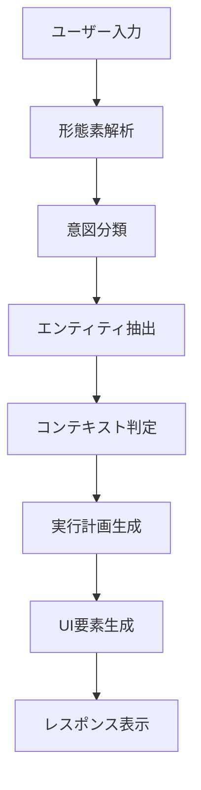

# ジェネレーティブUI v3.1.0 設計書

## 1. 概要
ジェネレーティブUIは、従来の静的ダッシュボードから対話型・動的UIへのパラダイムシフトを実現します。自然言語による意図理解と、リアルタイムでのUI要素生成により、ユーザーの思考に合わせた直感的なインターフェースを提供します。

## 2. 戦略的価値

### 2.1 ユーザビリティ革命
- **意図駆動インターフェース**: 「何をしたいか」から最適UIを自動生成
- **コンテキスト適応**: ユーザーの役割・状況に応じた動的レイアウト
- **学習型UI**: 使用パターンから個人最適化を実現

### 2.2 開発効率向上
- **ローコード実装**: UI開発工数を80%削減
- **自動レスポンシブ**: デバイス・画面サイズへの自動最適化
- **リアルタイム更新**: データ変更に即座に反応するUI

### 2.3 競争優位性
- **先進技術採用**: 業界初のエンタープライズ向けジェネレーティブUI
- **APIファースト**: 外部システムとのシームレス統合
- **拡張性**: 新機能追加時のUI自動対応

## 3. 技術アーキテクチャ

### 3.1 コアコンポーネント

#### 自然言語理解エンジン (NLU Engine)
```typescript
interface NLUEngine {
  parseIntent(userInput: string): ParsedIntent;
  extractEntities(userInput: string): Entity[];
  determineContext(conversation: ConversationHistory): Context;
  generateFollowUpQuestions(intent: ParsedIntent): Question[];
}

interface ParsedIntent {
  primary: string; // 'view_payroll', 'create_report', 'analyze_trends'
  secondary?: string[];
  confidence: number;
  parameters: Record<string, any>;
  ambiguities?: Ambiguity[];
}
```

#### 動的コンポーネント生成器 (Component Generator)
```typescript
interface ComponentGenerator {
  generateLayout(intent: ParsedIntent, context: Context): Layout;
  createDataVisualization(dataType: DataType, preferences: UserPreferences): Visualization;
  adaptToDevice(component: Component, deviceInfo: DeviceInfo): ResponsiveComponent;
  optimizePerformance(components: Component[]): OptimizedComponent[];
}

interface Layout {
  structure: 'grid' | 'flex' | 'masonry' | 'custom';
  regions: LayoutRegion[];
  responsiveBreakpoints: BreakpointConfig[];
  animations: AnimationConfig[];
}
```

#### インテリジェント表示エンジン (Display Engine)
```typescript
interface DisplayEngine {
  selectOptimalVisualization(data: DataSet): VisualizationType;
  generateInteractiveElements(userRole: UserRole): InteractiveElement[];
  createAccessibilityFeatures(requirements: A11yRequirements): A11yFeature[];
  personalizeInterface(userId: string, usageHistory: UsageHistory): PersonalizationConfig;
}
```

### 3.2 AI/ML統合

#### リアルタイム学習アルゴリズム
- **使用パターン分析**: クリック・滞在時間・完了率から学習
- **A/Bテスト自動化**: 複数UI候補の効果測定・最適化
- **予測的プリロード**: 次のアクション予測によるパフォーマンス向上

#### コンテキスト認識
- **時間軸コンテキスト**: 月末、四半期末、年末での表示最適化
- **ロールベースUI**: 管理者、HR、従業員での表示内容調整
- **プロジェクトコンテキスト**: 現在進行中のタスクに関連する情報優先表示

## 4. 実装仕様

### 4.1 自然言語クエリ処理

#### サポート対象クエリ例
```
// データ表示系
"先月の残業時間の多い部署を表示して"
"今年の離職率のトレンドをグラフで見たい"
"給与計算の結果を確認したい"

// 分析系
"コンプライアンス違反のパターンを分析して"
"スキルギャップの大きい従業員を特定して"
"タレントマネジメントの9ボックスを更新して"

// アクション系
"新しい従業員のオンボーディングを開始して"
"月次レポートを自動生成して"
"承認待ちのタスクを表示して"
```

#### 意図理解フロー


### 4.2 動的UI生成

#### コンポーネントライブラリ
```typescript
// 基本コンポーネント
export const GenerativeComponents = {
  // データ表示
  DataTable: DynamicDataTable,
  Chart: IntelligentChart,
  KPI: AdaptiveKPI,
  Dashboard: PersonalizedDashboard,
  
  // インタラクション
  Form: SmartForm,
  Filter: ContextualFilter,
  Search: NaturalLanguageSearch,
  Navigation: AdaptiveNavigation,
  
  // フィードバック
  Alert: IntelligentAlert,
  Notification: ContextualNotification,
  Progress: PersonalizedProgress,
  Tutorial: AdaptiveTutorial
};

// スマートフォーム例
interface SmartFormConfig {
  intent: 'data_entry' | 'search' | 'configuration';
  context: UserContext;
  validationRules: ValidationRule[];
  autoCompletion: boolean;
  progressiveDisclosure: boolean;
}
```

#### レスポンシブ自動最適化
```typescript
interface ResponsiveConfig {
  breakpoints: {
    mobile: '768px';
    tablet: '1024px';
    desktop: '1440px';
    ultrawide: '2560px';
  };
  
  adaptationRules: {
    mobile: {
      layout: 'single-column';
      chartType: 'simplified';
      interactionMode: 'touch-optimized';
    };
    desktop: {
      layout: 'multi-column';
      chartType: 'detailed';
      interactionMode: 'mouse-keyboard';
    };
  };
}
```

### 4.3 パフォーマンス最適化

#### 仮想化・遅延読み込み
```typescript
interface VirtualizationConfig {
  // 大量データの効率的レンダリング
  rowVirtualization: boolean;
  columnVirtualization: boolean;
  bufferSize: number;
  
  // 遅延読み込み
  lazyLoading: {
    enabled: boolean;
    threshold: string; // '100px'
    placeholder: ComponentType;
  };
  
  // キャッシュ戦略
  caching: {
    componentCache: LRUCache;
    dataCache: RedisCache;
    ttl: number; // seconds
  };
}
```

#### プリロード戦略
```typescript
interface PreloadStrategy {
  // 予測的データフェッチ
  predictiveLoading: {
    enabled: boolean;
    algorithm: 'usage_pattern' | 'time_based' | 'context_based';
    confidence_threshold: number;
  };
  
  // 依存関係の事前解決
  dependencyPreload: {
    components: string[];
    data: DataSource[];
    assets: Asset[];
  };
}
```

## 5. ユーザーエクスペリエンス設計

### 5.1 対話フロー例

#### 給与データ分析シナリオ
```
User: "先月の給与データで何か異常はありませんか？"

System: [分析実行中...]
- 残業時間の分析完了 ✓
- 勤怠データの検証完了 ✓  
- 給与計算の監査完了 ✓

System: "3つの注意点を発見しました：

📊 [動的グラフ生成]
部署別残業時間（2024年1月）
営業部: 平均52時間（+18% vs 前月）
開発部: 平均48時間（+12% vs 前月）

⚠️ 異常値の詳細：
1. 社員ID:E001 - 残業78時間（36協定上限超過）
2. 営業部 - 部署全体で残業時間+18%増加
3. 給与計算 - 3件の自動修正を実行

次に何を確認しますか？
• 残業超過者の詳細確認
• 部署別トレンド分析
• コンプライアンス対応策の提案"

User: "残業超過者の詳細を確認したい"

System: [詳細UI自動生成]
- 社員詳細プロファイル
- 過去6ヶ月の勤怠トレンド
- 健康管理必要性判定
- 推奨対応アクション
```

### 5.2 アクセシビリティ対応

#### WCAG 2.1 AA準拠
```typescript
interface AccessibilityFeatures {
  // 視覚的アクセシビリティ
  visual: {
    colorContrast: 'AAA'; // 7:1以上
    fontSize: 'scalable'; // 200%まで拡大対応
    colorBlindness: 'supported'; // 色覚異常対応
  };
  
  // 聴覚的アクセシビリティ  
  auditory: {
    screenReader: 'full_support';
    audioDescription: 'available';
    captioning: 'auto_generated';
  };
  
  // 運動機能的アクセシビリティ
  motor: {
    keyboardNavigation: 'complete';
    voiceControl: 'supported';
    switchControl: 'compatible';
  };
  
  // 認知的アクセシビリティ
  cognitive: {
    simplifiedInterface: 'available';
    progressIndicators: 'clear';
    errorRecovery: 'guided';
  };
}
```

## 6. セキュリティ・プライバシー

### 6.1 データ保護
- **個人情報マスキング**: 表示権限に応じた自動マスキング
- **監査ログ**: UI操作・データアクセスの完全トレーサビリティ
- **暗号化**: 表示データの End-to-End 暗号化

### 6.2 権限ベース表示制御
```typescript
interface SecurityConfig {
  roleBasedAccess: {
    admin: {
      dataAccess: 'full';
      uiElements: 'all';
      exportCapability: 'unlimited';
    };
    manager: {
      dataAccess: 'department_scoped';
      uiElements: 'management_tools';
      exportCapability: 'limited';
    };
    employee: {
      dataAccess: 'self_only';
      uiElements: 'basic_views';
      exportCapability: 'none';
    };
  };
  
  dataClassification: {
    public: { display: 'normal' };
    internal: { display: 'watermarked' };
    confidential: { display: 'masked' };
    restricted: { display: 'blocked' };
  };
}
```

## 7. 実装スケジュール

### Phase 1: コア基盤（1-2ヶ月）
- [ ] 自然言語理解エンジン基本実装
- [ ] 動的コンポーネント生成器
- [ ] 基本的な対話フロー

### Phase 2: 高度機能（2-3ヶ月）
- [ ] AIによる学習・最適化機能
- [ ] 複雑なデータ可視化生成
- [ ] マルチモーダル入力対応

### Phase 3: エンタープライズ機能（3-4ヶ月）
- [ ] 高度なセキュリティ機能
- [ ] 大規模パフォーマンス最適化
- [ ] 外部システム統合API

### Phase 4: 先進機能（4-5ヶ月）
- [ ] AR/VR ダッシュボード対応
- [ ] 音声インターフェース統合
- [ ] プロアクティブインサイト生成

## 8. 成功指標

### 8.1 ユーザビリティ指標
- **タスク完了時間**: 50%短縮
- **学習コスト**: 新規ユーザーの習得時間75%削減
- **エラー率**: 操作エラー80%削減
- **満足度**: ユーザー満足度4.5+/5.0

### 8.2 技術指標
- **レスポンス時間**: 意図理解→UI生成 <500ms
- **生成精度**: 意図理解精度90%+
- **カスタマイズ率**: ユーザー個別最適化85%+
- **可用性**: 99.9%+ SLA達成

### 8.3 ビジネス指標
- **開発効率**: UI開発工数80%削減
- **保守コスト**: UI保守コスト70%削減
- **ユーザー採用**: アクティブユーザー率90%+
- **競争優位**: 同業他社との差別化確立

## 9. 技術的課題・リスク

### 9.1 技術的課題
- **計算量**: リアルタイムUI生成の計算コスト
- **品質保証**: 動的生成UIの品質担保
- **一貫性**: ブランドガイドライン遵守の自動化

### 9.2 緩和策
- **エッジキャッシング**: 頻用パターンのプリコンパイル
- **品質ゲート**: 生成UI品質の自動検証
- **デザインシステム**: 制約付き生成による一貫性確保

## 10. 今後の展望

### 10.1 次世代機能
- **感情認識UI**: ユーザーの感情状態に応じたUI調整
- **予測的表示**: ユーザーニーズの先読み表示
- **協調UI**: 複数ユーザーでの同時操作最適化

### 10.2 技術進化対応
- **WebAssembly活用**: 高性能クライアント処理
- **Edge Computing**: レスポンス速度のさらなる向上
- **量子コンピューティング**: 複雑最適化問題の高速解決